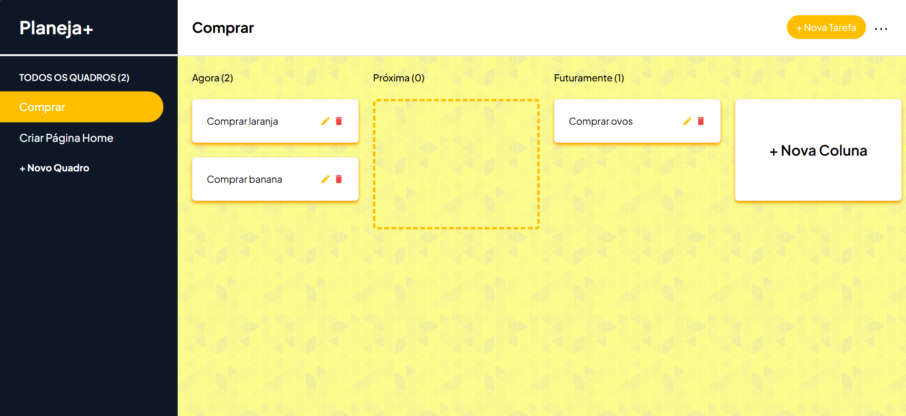
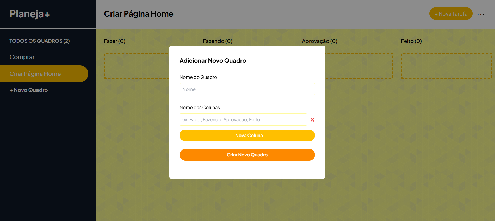
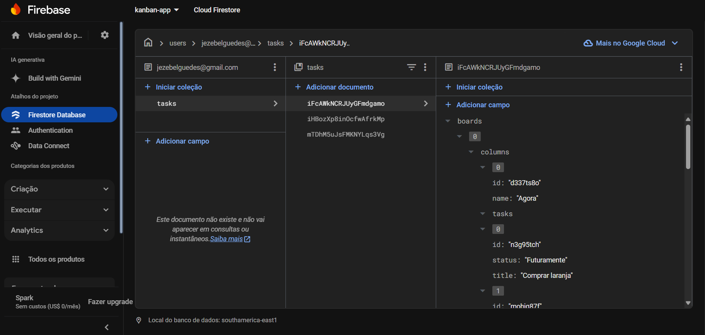

# Planeja+ | Gerenciador de Tarefas Kanban Full-Stack

> Esta é uma aplicação full-stack desenvolvida para gerenciamento de tarefas em estilo Kanban. Este projeto utiliza tecnologias modernas e boas práticas de desenvolvimento, incluindo autenticação, gerenciamento de estado, interação de arrastar e soltar, e integração com Firebase Firestore.





## 📋 Funcionalidades
- Autenticação de usuários com a biblioteca next-auth.
- Gerenciamento de estado otimizado com Redux Toolkit para caching de dados do Firestore.
- CRUD completo para criação, leitura, atualização e exclusão de quadros e tarefas.
- Interface interativa com suporte a arrastar e soltar usando a biblioteca react-beautiful-dnd.
- Armazenamento de dados no Firebase Firestore.


Gerenciador de Tarefas Kanban Full-Stack
Bem-vindo ao repositório do Gerenciador de Tarefas Kanban, uma aplicação full-stack desenvolvida para gerenciamento de tarefas em estilo Kanban. Este projeto utiliza tecnologias modernas e boas práticas de desenvolvimento, incluindo autenticação, gerenciamento de estado, interação de arrastar e soltar, e integração com Firebase Firestore.

## 🛠️ Tecnologias Utilizadas
- **Next.js:** Framework React para renderização server-side e geração estática.
- **Next-auth:** Autenticação simplificada para Next.js.
- **Firebase Firestore:** Plataforma de backend como serviço para persistência de dados.
- **Redux Toolkit:** Gerenciamento de estado moderno e simplificado.
- **React-beautiful-dnd:** Biblioteca para interações de arrastar e soltar.
- **Tailwind CSS:** Framework de CSS para o design responsivo e estilização da interface.


## Como Rodar o Projeto

1. Clone este repositório:
   ```bash
  git clone  https://github.com/Jezebel1990/kanban-app.git
  cd kanban-app
```

2. Instale as dependências:
  ```bash
    npm install
   ```
3. Execute o projeto em desenvolvimento:
  ```bash
    npm run dev
   ```
4. Abra o navegador em `http://localhost:3000` para ver a aplicação.


## Licença
Este projeto está licenciado sob a licença MIT - veja o arquivo LICENSE para mais detalhes.

Feito com ♥ por [Jezebel Guedes](https://www.linkedin.com/in/jezebel-guedes/) 👋 Entre em contato!
